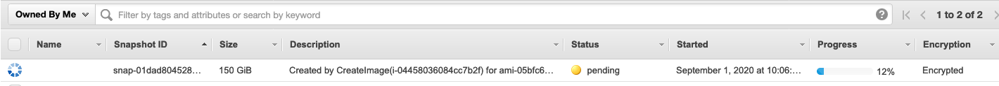

# Software Stacks (AMIs)

A Software Stack is an pre-configured AMI. As administrator, you can register Linux or Windows AMI. A Software Stack is particularly useful if you are planning to pre-install applications on behalf of your users

<figure><figcaption><p>List all AMI available to the users</p></figcaption></figure>

### Prepare the EC2 instance to be used as Software Stack

#### Windows


**IMPORTANT**

A Software Stack, also known as Amazon Machine Image (AMI) is a complete snapshot of your EC2 host.&#x20;

**Make sure you do not have any confidential data hosted on it before creating the image**

Here is a non exhaustive list of item you should check before creating the snapshot:

* [x] Verify you have not stored any password on your internet browser. It's recommended to clear the cache of all the browsers you have used.
* [x] Verify there is no confidential information on your current $HOME directory.
* [x] Verify your Document/Download/Desktops folders are empty or don't contains any confidential information.
* [x] As an extra step, you can completely delete your $HOME directory


First, launch your Virtual Desktop and install some applications. Once you are done, click the Search Button and right-click on "Windows PowerShell" to "Run As Administrator".

<figure><figcaption><p>Click Windows button and launch "Windows Powershell"</p></figcaption></figure>

On the Powershell terminal, execute the following command to re-enable the execution of EC2 UserData script.

```powershell
C:\ProgramData\Amazon\EC2-Windows\Launch\Scripts\InitializeInstance.ps1 -Schedule
```

<figure><figcaption><p>Re-enable EC2 UserData Script</p></figcaption></figure>

At this point, go back to the VDI web-interface, select your Virtual Desktops and click "**Action**" > "**Show Info**" to display detailed details about your instance, then search of "**Instance ID**"

<figure><figcaption><p>Locate the instance ID of the dektop you are about to snapshot</p></figcaption></figure>

On your EC2 console and search for your instance. Once done, select the instance and click "**Actions**" > "**Image**" > "**Create Image**"

<figure><figcaption><p>Create an image of your EC2 Desktop</p></figcaption></figure>

Choose a name and a description, make sure to check "**No Reboot: Enable**" then click "**Create Image**"

<figure><figcaption><p>Make sure "No Reboot" is enabled.</p></figcaption></figure>

Navigate to the AMI tab and verify if your image status is "available"


**My AMI is taking forever:**

You will not be able to use your image until the status is available.

Creating an AMI may take a couple of hours depending the size of the image.

To check the progress of your image, navigate to "Snapshots" section and refer to the `Progress` column for all EBS volumes created by your image




Once your AMI is in available state, log in to IDEA and refer to  [#register-a-new-software-stack-on-idea](software-stacks-amis.md#register-a-new-software-stack-on-idea "mention")


### Register a new Software Stack on IDEA

<figure><figcaption></figcaption></figure>
