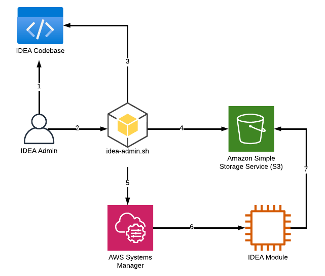

# Create a virtual desktop (Linux/Windows)

To access the Virtual Desktop section, click "**Virtual Desktops**" on the left sidebar:

<figure><figcaption></figcaption></figure>

To launch your virtual desktop click "**Launch new Virtual Desktop"** button. You will be prompted with a new modal asking you a couple of questions:

* **Session Name**: A name for your desktop
* **Project**: The project your session will get created. Refer to "Projects Management" section under [Cluster Manager](https://app.gitbook.com/o/ewXgnQpSEObr0Vh0WSOj/s/GtBrWw9T1qCJK2QCOTW2/ "mention") to learn more about projects.
* **Operating System**: The operating system you want to use from:
  * **Linux**
    * Amazon Linux 2
    * CentOS 7
    * Red Hat Enterprise Linux 7
  * **Windows**:
    * Windows Server 2019
* **Software Stack**: A software stack is an EC2 AMI with pre-installed and pre-configured applications defined by your cluster administrator. Refer to [software-stacks-amis.md](../vdi-admins/software-stacks-amis.md "mention") to learn how to create custom software stack for your team.
* **Hibernation**: Select whether or not you want to enable hibernation for your session. You must be verify if your EC2 instance supports hibernation first
* **Virtual Desktop Size:** Instance type to provision. Select of EC2 instance types is based on the list of instances safe-listed by your cluster administrator and the project selected. You can change this value later without having to re-create a new desktop (see [modify-a-virtual-desktop.md](modify-a-virtual-desktop.md "mention"))
* **Storage Size**: Size of the main EBS partition
* **Advanced Options**: Advanced option such as enforcing a subnet ID or choose the DCV sessions type

<figure><figcaption></figcaption></figure>

Click "**Submit**" button to launch your virtual desktop creation. You will instantly see a new card with your desktop information. Your virtual desktop will be ready within 10-15 minutes. Startup time is based on the image selected, the operating system as well as the instance type.

<figure><figcaption>
Desktop being started
</figcaption></figure>

Wait a couple of minutes until your desktop is ready.


IDEA automatically detects GPU instances and install the relevant drivers (NVIDIA GRID, NVIDIA Tesla, AMD) automatically


## How to access your Windows or Linux desktop

Once your virtual desktop is up and running, you can click the card and connect it either via web or DCV client.&#x20;

Easiest: Access your desktop from within your web browser

Click "**Connect**" button or click the thumbnail to access your Windows or Linux desktop directly via your browser.

Best Performance: Use DCV Client 

Click "**DCV Session File**" button to download your `.dcv` file. To open this file, you will need to have the DCV Client installed on your system. Click the "**?**" icon to access to the download link and installation instructions.

<figure><figcaption>
Virtual Desktop ready to be used
</figcaption></figure>

## How to change the schedule of your Windows or Linux desktop

By default, your virtual desktop come with no schedule, which means your desktop will stay up until you stop/terminate it, and will stay stopped until you turn it back on. You can change this behavior by configuring your own scheduling, and IDEA will ensure your desktop will automatically start/stop based on your own requirements.


Virtual Desktop will only be stopped if idle (e.g: no active session connected and CPU usage below 15% for at least 15 minutes). This is meant to prevent accidental stop and ensure you won't have to worry if you have a simulation running on your desktop overnight but have configured auto-stop after 8PM


You can at any moment review whether or not you have a schedule configured on your desktop by checking the top bar of your session (note: schedule are unique to each desktop)

To create/edit a schedule, click then This will open a new modal where you will be able to choose the schedule for any given day:

Simply click the dropdown menu to chose your schedule for that day using the different presets below:

| Mode            | Running Desktop                        | Stopped Desktop                                |
| --------------- | -------------------------------------- | ---------------------------------------------- |
| No Schedule     | Stay running until you stop/terminate  | Stay stopped until you manually restart it     |
| Stop All Day    | Will be stopped if idle after 00H      | Will stay stopped                              |
| Started All Day | Will stay running                      | Will be automatically started after 00H        |
| Working Hours   | Will be started at 9 AM                | Will be stopped if idle after 5 PM             |
| Custom Schedule | Will be started based on your own time | Will be stopped if idle based on your own time |


Schedule is re-evaluated every 30 minutes


## How to change the hardware of your Windows or Linux Desktop&#x20;

First, you must stop your current desktop before being able to upgrade/downgrade the instance type associated to your desktop. To do so, click  then and 


Stopping a desktop will not cause any data loss.


Wait until the state of your desktop is. Click  then  and choose your new instance.


You can verify what instance type is used by your virtual desktop by checking the desktop setting bar:&#x20;

&#x20;


Once your instance is changed, restart your desktop by clicking thenand  .

## Stop/Terminate/Hibernate your Windows or Linux Desktop

### Stop

Click then  and finally to stop your current virtual desktop session. Stopped session will not suffer any data loss and you can restart a stopped session at any moment.

### Terminate

Click then  and finally to permanently terminate a virtual desktop  session. Terminating a session may cause data loss if you are using ephemeral storage, so make sure to have uploaded all your data back to IDEA filesystem first.

### Hibernate


When you hibernate an instance, your desktop state is saved in memory. When you restart it, all your applications will automatically resume. On the other hand, stopping a virtual desktop is the same as powering off your laptop. Note not all EC2 instances support hibernation.


Click then  and finally "Hibernate" to hibernate your current virtual desktop session. Hibernated session will not suffer any data loss and you can restart the session at any moment.&#x20;

## Retrieve Session Information

Click then  to retrieve your session information such as instance type, subnet id, operating system etc ...

